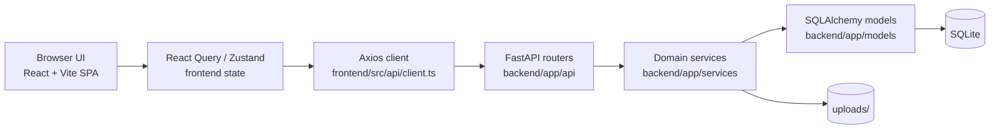
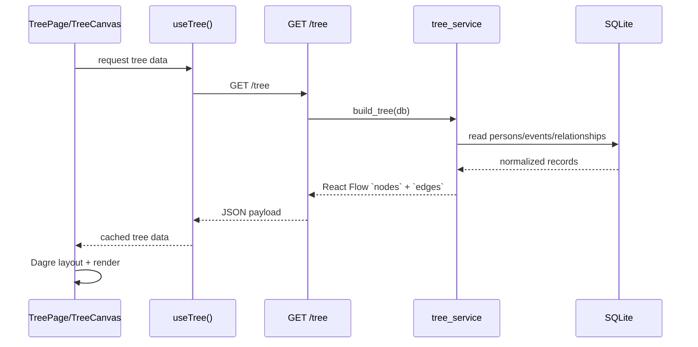

# ReRooted Architecture

## Scope

This document describes the **implemented architecture** in the current repository snapshot, with emphasis on the now-functional web frontend under `frontend/src/` and its contract boundary to the FastAPI backend.

It is intentionally **developer-facing** and documents:

- runtime structure
- layer boundaries
- cross-layer data flow
- non-obvious design constraints
- extension and debugging considerations

For subsystem-level detail, see:

- `docs/frontend/app.md`
- `docs/frontend/tree-canvas.md`
- `docs/frontend/person-panel.md`
- `docs/design-decisions/frontend-state-management.md`
- `docs/design-decisions/frontend-visualization.md`

---

## High-Level System Overview

ReRooted is a browser-based genealogy system with a clear split between:

1. **Frontend SPA** (`React` + `TypeScript` + `Vite`)
   - renders the family graph with `@xyflow/react`
   - manages local UI state, optimistic updates, theme selection, search, and export actions
   - orchestrates document/photo uploads and person editing flows

2. **Backend API** (`FastAPI` + `SQLAlchemy`)
   - persists persons, events, relationships, citations, files, and places
   - projects stored genealogy data into React Flow-compatible `nodes` + `edges`
   - handles GEDCOM preview/import/export and file storage

3. **Persistence + file storage**
   - `SQLite` database (`rerooted.db` by default)
   - uploaded media under `uploads/`
   - schema evolution through Alembic revisions

### Runtime Topology



---

## Layer Separation

### Frontend Layers

| Layer | Primary files | Responsibility | Dependency boundary |
|---|---|---|---|
| App shell | `main.tsx`, `App.tsx`, `layouts/AppLayout.tsx` | provider composition, routing, top-level layout, global error containment | must not contain domain logic |
| API contracts | `api/*.ts` | typed HTTP contracts and URL handling | must remain backend-aligned |
| Query/mutation hooks | `hooks/*.ts` | server-state orchestration, optimistic updates, cache invalidation | should not render UI |
| Feature modules | `features/tree/**`, `features/persons/**` | domain behavior and interaction flows | consume hooks/contracts, not raw `fetch` |
| Shared UI components | `components/**` | reusable controls and dialogs | should stay presentation-focused where possible |
| Theme system | `design/tokens.css`, `design/templates/**`, `hooks/useTemplate.ts` | runtime styling and background/template selection | styling concerns only |

### Backend Layers

| Layer | Primary files | Responsibility | Dependency boundary |
|---|---|---|---|
| HTTP/transport | `backend/app/api/**` | routing, status codes, dependency injection | delegates business logic |
| Domain services | `backend/app/services/**` | validation, orchestration, graph projection, GEDCOM processing | no FastAPI-specific UI logic |
| Schemas | `backend/app/schemas/**` | request/response validation and serialization | no DB I/O |
| ORM models | `backend/app/models/**` | persistence shape and relationships | no service logic |
| Infrastructure | `backend/app/core/**`, `backend/migrations/**` | config, DB sessions, schema migration | feature-agnostic |

---

## Cross-Layer Data Flows

### 1. Tree Visualization Flow



Key property: the backend owns the **semantic graph**, while the frontend owns **visual layout direction and viewport behavior**.

### 2. Person Editing Flow

```text
Select person node
  -> `usePerson(personId)` loads person detail
  -> `PersonPanel` opens with tab state
  -> `InfoTab` builds local draft from `PersonDetail`
  -> debounce-based auto-save issues `PUT /persons/{id}` and event mutations
  -> React Query invalidates `['person', id]`, `['tree']`, and related lists
```

Important detail: birth and death are represented as **events**, not dedicated scalar columns. The frontend therefore maps between UI fields and event records in `InfoTab`.

### 3. Media and Document Flow

```text
Drop file in PhotosTab/DocumentsTab
  -> upload to `/files/upload`
  -> backend stores file + optional thumbnail
  -> frontend attaches file via `/persons/{id}/images` or creates source + citation
  -> affected queries invalidated
  -> panel re-renders with canonical backend state
```

For documents, the citation may be linked either:

- to a specific event (`/events/{event_id}/citations`), or
- directly to the person (`/persons/{person_id}/citations`)

which enables documents **without** an associated event.

### 4. GEDCOM Flow

```text
ImportPage
  -> upload `.ged` file
  -> preview via `POST /import/gedcom/preview`
  -> confirm import via `POST /import/gedcom`
  -> tree/person queries invalidated
```

GEDCOM export remains a backend-owned blob download via `GET /export/gedcom`.

### 5. Image Export Flow

```text
User opens photo export menu
  -> frontend fetches supported formats from `GET /export/image-formats`
  -> actual PNG/JPG/SVG rendering happens client-side with `html-to-image`
  -> toolbar/header are filtered from the exported snapshot
```

The backend currently exposes **export metadata**, not server-side bitmap rendering.

---

## Design Principles in the Current Code

### Modularity

The codebase is intentionally split by concern:

- tree rendering is isolated under `frontend/src/features/tree/`
- person editing lives under `frontend/src/features/persons/`
- API contracts and mutations are separated from UI components
- backend services are domain-scoped (`person_service`, `relationship_service`, `source_service`, `tree_service`, etc.)

This reduces hidden coupling and makes feature work traceable to one domain area.

### Separation of Concerns

Clear examples in the current implementation:

- `frontend/src/api/client.ts` owns API base URL and error logging
- `frontend/src/hooks/usePersonMutations.ts` owns invalidation strategy
- `frontend/src/features/tree/useLayout.ts` owns only layout heuristics
- `backend/app/services/tree_service.py` owns graph projection for the frontend

### Batch Safety

Batch safety appears in places where partial state would be especially harmful:

- GEDCOM import performs structured processing before committing the final result
- file handling is encapsulated in service functions rather than scattered across routes
- the frontend re-fetches canonical backend data after optimistic operations to converge on a stable state

### Idempotency

Examples of idempotent or idempotency-friendly behavior already present:

- repeated GEDCOM imports can match persons by `gramps_id`
- place normalization reduces accidental duplication during import
- React Query invalidation ensures stale optimistic state is reconciled with the backend after writes

---

## Dependency Boundaries Worth Preserving

When extending the system, keep these constraints intact:

1. **Frontend components should call hooks or typed API helpers, not raw ad hoc network code.**
2. **Frontend feature modules should not embed persistence assumptions** beyond documented contracts.
3. **Routers remain thin** and should continue delegating logic to services.
4. **The backend returns semantic genealogy structures; the frontend chooses visual layout strategy.**
5. **Image export remains client-side** unless a future server-rendered export pipeline is explicitly introduced.

---

## Current Architectural Constraints

These are implementation facts, not roadmap promises:

- the browser currently loads and renders the full tree in memory; there is no pagination or viewport-based virtualization
- authentication and multi-user concurrency control are not present
- the routed frontend surface is intentionally small: `/` for the tree workspace and `/import` for GEDCOM import
- `frontend/src/pages/PersonsPage.tsx` exists as a code artifact but is not part of the active route map

---

## Debugging Orientation

When diagnosing frontend/backend integration issues, start with the following boundaries:

| Symptom | Most likely boundary |
|---|---|
| blank or oddly framed tree | `TreeCanvas.tsx`, `useLayout.ts`, React Flow viewport fitting |
| missing person updates after edit | React Query invalidation in `usePersonMutations.ts` |
| broken document/photo attachment | `/files/upload`, citation routes, tab-specific query mapping |
| wrong export output | `useCanvasExport.ts` and export menu filtering |
| theme/background inconsistencies | `useTemplate.ts` + `design/templates/types.ts` |

This division mirrors the actual code ownership model and is the fastest route to root cause analysis.
