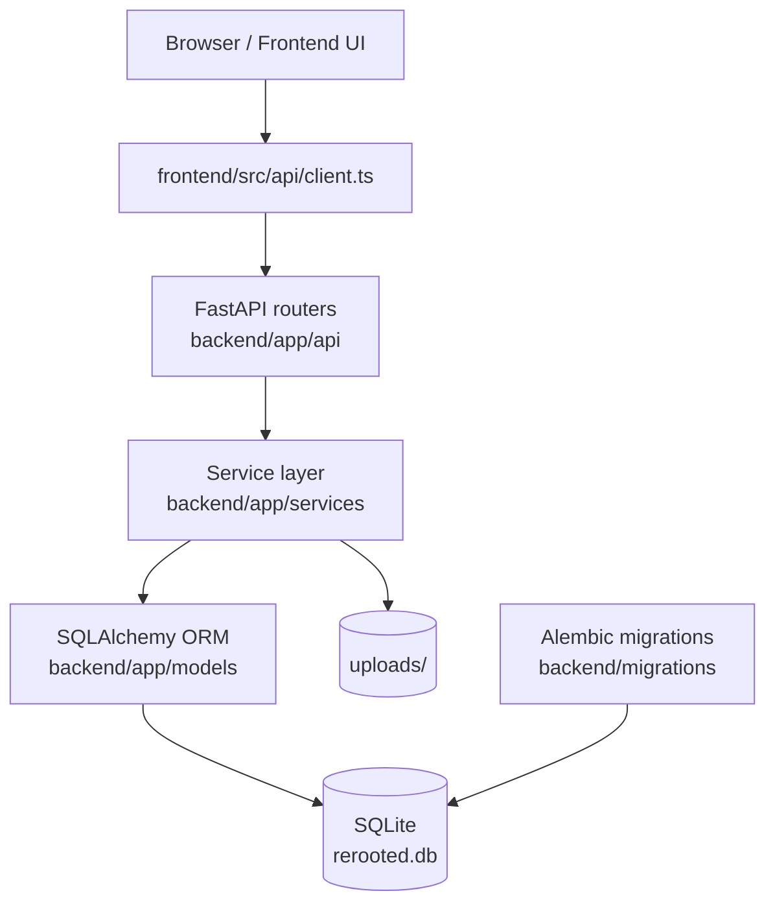

# ReRooted Architecture

## Scope

This document describes the **current implementation** of ReRooted as it exists in the repository:

- backend runtime under `backend/app/`
- database migrations under `backend/migrations/`
- frontend scaffold under `frontend/src/`
- automated tests under `tests/`

It is **developer-facing documentation**. It intentionally focuses on internal structure, runtime behavior, and extension boundaries rather than end-user instructions.

---

## System Overview

ReRooted is a **web-based genealogy system** built around a FastAPI backend and a scaffolded TypeScript frontend.

The backend owns:

- persistence (`SQLite` via `SQLAlchemy`)
- API contracts (`FastAPI` + `Pydantic`)
- family graph generation for React Flow (`/tree`)
- media upload and thumbnail generation
- GEDCOM preview/import/export workflows

The frontend currently acts as a **typed integration scaffold**. It contains API hooks, feature boundaries, and design tokens, but the page and component implementations are still largely placeholders.

---

## Runtime Topology



---

## Repository-Level Responsibilities

| Path | Responsibility |
|---|---|
| `backend/app/main.py` | FastAPI application factory, middleware, exception handling, router registration |
| `backend/app/core/` | configuration and DB engine/session setup |
| `backend/app/models/` | SQLAlchemy ORM entities and enums |
| `backend/app/schemas/` | Pydantic request/response contracts |
| `backend/app/services/` | business logic, graph transformation, import/export workflows |
| `backend/app/api/` | HTTP layer only; delegates to services |
| `backend/migrations/` | Alembic revision history |
| `frontend/src/` | frontend scaffold, API hooks, layout/page boundaries, design tokens |
| `tests/` | unit, integration, and API contract tests |
| `uploads/` | canonical media and thumbnail storage |
| `rerooted.db` | canonical SQLite database file |

---

## Layer Separation

The backend follows a conventional layered architecture.

| Layer | Purpose | Can depend on | Must not depend on |
|---|---|---|---|
| `api/` | HTTP routing, dependency injection, status codes | `schemas`, `services`, `core.database` | direct SQL queries or ORM writes |
| `services/` | business rules and orchestration | `models`, `schemas`, `utils`, `core.config` | FastAPI dependency injection primitives |
| `schemas/` | validation and serialization | `models` enums/types, Pydantic | database access, service logic |
| `models/` | persistence structure and relations | SQLAlchemy core/ORM | services, routers |
| `core/` | configuration and DB bootstrap | stdlib, SQLAlchemy, Pydantic settings | feature-specific logic |
| `utils/` | reusable helpers (`date_parser`) | stdlib | routers or DB session management |

### Practical Dependency Rules

1. **Routers call services** and obtain `db: Session` through `Depends(get_db)`.
2. **Services own all mutations** and lookups.
3. **Schemas define contracts only**.
4. **Models are the single source of persistence structure**.

---

## Primary Data Flows

### 1. Person + Event Mutation Flow

```text
HTTP request
  -> Pydantic schema validation
  -> service validation (person/place existence, etc.)
  -> ORM object creation/update
  -> commit + refresh
  -> schema serialization back to JSON
```

Important behavior:

- `event_service.create_event()` and `update_event()` derive `date_sort` from `date_text` using `parse_flex_date()`.
- `person_service.get_by_id()` eagerly loads `birth_place`, `events`, and `images`, then sorts events in memory for stable output.

### 2. Tree Graph Generation

```text
GET /tree
  -> tree_service.build_tree(db)
  -> load persons, birth/death events, relationships
  -> derive node payloads
  -> derive partner edges + child edges
  -> return React Flow compatible graph structure
```

This is the core backend-to-frontend bridge for family visualization.

### 3. File Upload Flow

```text
multipart upload
  -> MIME type check
  -> bounded read (size limit)
  -> safe basename extraction
  -> file write to uploads/
  -> thumbnail generation
  -> DB record commit
  -> `/files/{id}` + `/files/{id}/thumb` URLs returned
```

### 4. GEDCOM Import/Export Flow

```text
GEDCOM upload
  -> extension + size validation
  -> parse bytes (library if available, regex fallback otherwise)
  -> normalize persons/families/events/places
  -> deduplicate places
  -> upsert persons by gramps_id
  -> create events and relationships
  -> single commit
```

Export reverses the process and anonymizes living persons.

---

## Design Principles Visible in Code

### Modularity

Each domain concern has a dedicated service:

- persons
- events
- places
- relationships
- sources/citations
- files
- GEDCOM
- tree projection

This keeps feature logic locally coherent and avoids large monolithic routers.

### Separation of Concerns

The project separates:

- **transport concerns** (`api/`)
- **domain/pipeline concerns** (`services/`)
- **storage concerns** (`models/`, `core/database.py`)
- **serialization concerns** (`schemas/`)

### Batch Safety

The import pipeline is designed to reduce partial writes:

- GEDCOM import performs parsing and object creation first, then commits once at the end.
- file upload services clean up written files if the database write fails.

### Idempotency

Two important idempotent behaviors are present:

1. `place_service.get_or_create()` deduplicates places case-insensitively.
2. `gedcom_service._create_persons()` upserts persons by `gramps_id`, allowing safe re-import of the same GEDCOM dataset without creating duplicate persons.

---

## Current Boundaries and Limitations

These are **current implementation facts**, not future promises.

- The backend is functionally richer than the frontend at this stage.
- The frontend pages and components mostly return `null`; they define structure and type boundaries but not full UI behavior yet.
- SQLite is the only configured persistence backend.
- Authentication, authorization, background jobs, and caching are **not implemented in the current codebase**.
- Placeholder routers exist for `imports` and `exports`, but the active import/export behavior is currently implemented through GEDCOM-specific endpoints.

---

## Extension Guidance

Developers extending the system should preserve these boundaries:

- add new business behavior in `backend/app/services/`
- expose it via thin routers in `backend/app/api/`
- keep response contracts explicit in `backend/app/schemas/`
- use Alembic for schema evolution
- keep runtime artifacts anchored to the repo-root `rerooted.db` and `uploads/`

This preserves the current architecture and minimizes hidden coupling.
