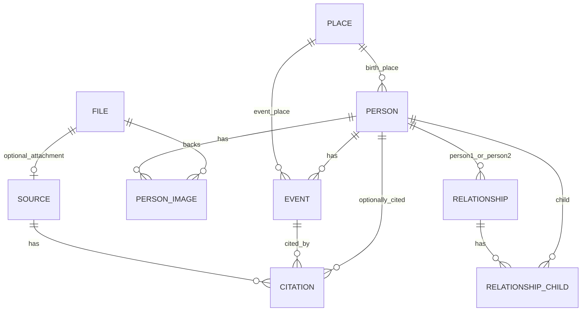

# Database Model and Migration Architecture

## Persistence Stack

ReRooted currently uses:

- `SQLite` for storage
- `SQLAlchemy 2.x` for ORM mapping
- `Alembic` for schema versioning

The canonical database file is the repo-root `rerooted.db`.

---

## Database Bootstrap

The SQLAlchemy engine is created in `backend/app/core/database.py`.

### SQLite-specific configuration

On each connection the backend enables:

- `PRAGMA journal_mode=WAL`
- `PRAGMA foreign_keys=ON`

This combination improves local development ergonomics while keeping foreign-key checks active.

---

## Migration Strategy

Alembic configuration lives in:

- `backend/alembic.ini`
- `backend/migrations/env.py`
- `backend/migrations/versions/0001_initial.py`

### How migrations are wired

- `env.py` imports `Base.metadata` from `app.core.database`
- it also imports `app.models` so all ORM tables are registered
- the database URL is synchronized from `settings.database_url`

This means the migration runtime follows the same configured DB target as the application itself.

---

## Schema Overview



---

## Tables and Roles

| Table | Role | Important columns |
|---|---|---|
| `places` | normalized location records | `name`, `full_name`, `latitude`, `longitude`, `gramps_id` |
| `files` | uploaded media metadata | `filename`, `content_type`, `path` |
| `sources` | source metadata | `title`, `author`, `date`, `url`, `file_id` |
| `citations` | links sources to persons/events | `source_id`, `person_id`, `event_id`, `page`, `confidence` |
| `persons` | core genealogy entity | `first_name`, `last_name`, `is_living`, `birth_place_id`, `description`, `gramps_id` |
| `person_images` | association between persons and files | `person_id`, `file_id`, `is_profile`, `caption` |
| `events` | dated facts attached to persons | `person_id`, `event_type`, `date_text`, `date_sort`, `place_id`, `description`, `is_private` |
| `relationships` | pairwise relationship records | `person1_id`, `person2_id`, `rel_type`, `start_date`, `end_date` |
| `relationship_children` | child membership per relationship | `relationship_id`, `child_id` |

All primary keys are string UUIDs generated in the model layer.

---

## Enums in the Schema

### `EventType`

Stored values:

- `birth`
- `death`
- `baptism`
- `marriage`
- `divorce`
- `emigration`
- `immigration`
- `occupation`
- `residence`
- `other`

### `RelType`

Stored values:

- `partner`
- `ex`
- `adoption`
- `foster`
- `unknown`

### `Confidence`

Stored values:

- `low`
- `medium`
- `high`

These enums are defined both in SQLAlchemy models and in the initial Alembic migration.

---

## Relationship Modeling Strategy

Instead of storing parent references directly on each `Person`, ReRooted uses:

- a `relationships` table for the adult relationship itself
- a `relationship_children` association table for children belonging to that relationship

### Why this matters

This design supports:

- patchwork families
- adoption/foster semantics
- partner history over time
- graph projection where one child may receive two parent edges tied to a specific relationship record

A child is therefore connected to a **relationship instance**, not just to a person.

---

## Derived Semantics at the ORM Layer

Some output fields are not stored directly as columns but are derived from model relations.

### `Person.profile_image_url`

Computed from the linked `PersonImage` rows:

1. first profile-marked image if one exists
2. otherwise first available image
3. returned as `/files/{file_id}`

### `Event.place_name`

Derived from the eager-loaded `place` relation and exposed as a plain string.

### `Relationship.child_ids`

Flattened from `Relationship.children` into `list[str]` for API output.

### `Citation.source_title`

Exposed from the linked `Source` to reduce round-trips at the HTTP layer.

---

## Cascade and Integrity Behavior

Current ORM cascade rules include:

| Parent | Child relation | Cascade |
|---|---|---|
| `Person` | `events` | `all, delete-orphan` |
| `Person` | `images` | `all, delete-orphan` |
| `Event` | `citations` | `all, delete-orphan` |
| `Source` | `citations` | `all, delete-orphan` |
| `Relationship` | `children` | `all, delete-orphan` |

This means most object-graph cleanup occurs at the ORM level during service-layer deletes.

---

## Indexing and Lookup Patterns

The initial migration adds indexes on fields that are used frequently for lookups:

- `places.gramps_id`
- `persons.gramps_id`
- `events.person_id`
- `citations.source_id`
- `citations.person_id`
- `citations.event_id`
- `relationships.person1_id`
- `relationships.person2_id`
- `person_images.person_id`

This aligns with the current query profile of:

- person detail loading
- GEDCOM upsert by `gramps_id`
- relationship lookup by person
- citation lookups by event/source

---

## Test Database Behavior

The test suite does **not** use the repo-root SQLite file.

`tests/conftest.py` creates an in-memory SQLite database with:

- `StaticPool`
- `check_same_thread=False`
- schema recreation between test cases

This keeps tests isolated from local runtime data while still exercising the real ORM mappings.

---

## Practical Migration Commands

```powershell
cd backend
..\.venv\Scripts\python.exe -m alembic -c .\alembic.ini upgrade head
```

Use Alembic for persistent schema changes. Tests use transient metadata creation only.
