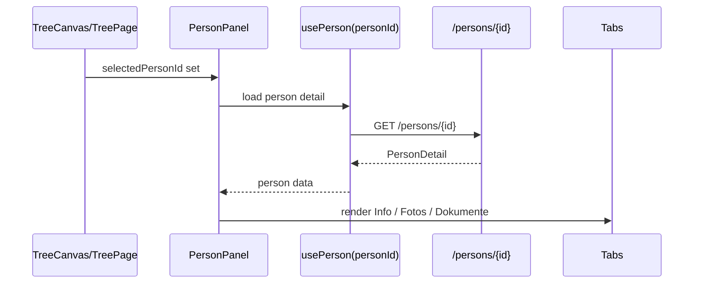

# Person Panel Architecture

## Scope

This document describes the right-side person editor implemented in:

- `frontend/src/features/persons/PersonPanel.tsx`
- `frontend/src/features/persons/PersonPanelHeader.tsx`
- `frontend/src/features/persons/tabs/InfoTab.tsx`
- `frontend/src/features/persons/tabs/PhotosTab.tsx`
- `frontend/src/features/persons/tabs/DocumentsTab.tsx`
- `frontend/src/components/EventTimeline.tsx`
- `frontend/src/hooks/usePerson.ts`
- `frontend/src/hooks/usePersonMutations.ts`

The panel is the main structured editing surface once a node is selected in the tree.

---

## Panel Lifecycle

`PersonPanel` is mounted only when `selectedPersonId` is not `null`.

This is significant because the panel is **ephemeral UI state**, not part of the route structure.

---

## Composition Overview

### Structural pieces

| Component | Responsibility |
|---|---|
| `PersonPanel` | loading shell, tab switching, close behavior, delete confirmation |
| `PersonPanelHeader` | identity/header actions, profile image upload, quick relative actions |
| `InfoTab` | core person fields, birth/death data, relationship summary, event timeline |
| `PhotosTab` | image upload, preview, metadata editing, profile image selection |
| `DocumentsTab` | document upload, source/citation linkage, PDF preview, file download/delete |
| `ConfirmDialog` | deletion confirmation |

### Active tabs

The current panel exposes three tabs only:

- `Info`
- `Fotos`
- `Dokumente`

`Quellen` is no longer a top-level tab in the current UI.

---

## Header Behavior

`PersonPanelHeader` combines identity and actions that should always stay visible.

### Current responsibilities

- display or edit person name
- upload / change profile image
- focus the `Info` tab when needed
- open delete confirmation
- trigger creation presets for:
  - child
  - partner
  - parent
  - sibling

The quick-relative buttons do not directly mutate relationships themselves. They delegate to `TreePage`, which opens the shared quick-add flow with a relationship preset.

---

## `InfoTab`: Draft + Auto-Save Model

`InfoTab` is the most stateful tab in the panel.

### Draft construction

`buildDraft(person)` maps `PersonDetail` into a UI-friendly draft object that includes:

- scalar person fields (`first_name`, `last_name`, `description`, `current_address`, `phone_number`, `is_living`)
- derived birth/death date and place fields extracted from `person.events`

This mapping matters because birth and death are not stored only as person columns; they are represented as event rows.

### Save strategy

The tab uses **debounced auto-save** rather than an explicit “Save” button.

Implementation details:

- a serialized snapshot is stored in `lastSavedRef`
- when the draft differs, a `setTimeout(..., 800)` starts
- `persistDraft()` computes a minimal patch rather than sending all fields blindly
- event changes are saved via `useSaveEvent()`; person scalar changes via `useUpdatePerson()`

### Save states exposed in the UI

| State | Meaning |
|---|---|
| `idle` | no unsaved changes or save just settled |
| `saving` | debounce finished and mutation is running |
| `saved` | last mutation set completed successfully |
| `error` | at least one write failed |

### Relationship summary block

`InfoTab` also fetches:

- `/relationships?person_id=...`
- `/persons`

and builds a read-only textual summary such as partner/family labels and child counts. This is separate from the editable timeline and exists as a quick structural overview.

---

## `EventTimeline`: Event Editing Surface

`EventTimeline` is reused inside `InfoTab` to expose structured event CRUD.

It supports:

- rendering existing events in chronological order
- opening an inline editor for a selected event
- creating new event records
- deleting events

This keeps event editing separate from the scalar-person form, while still living inside the same panel.

---

## `PhotosTab`: Media Pipeline

### Upload flow

1. user drops JPEG/PNG/WEBP files
2. `useDropzone()` validates type and size (`20 MB` max)
3. optimistic preview URL is created with `URL.createObjectURL()`
4. `useUploadPersonImage()` uploads the file and links it to the person
5. pending preview is removed after the mutation settles

### Metadata editing

Each image exposes local draft fields for:

- `caption`
- `date_text`
- `place_text`

Saving these calls `useUpdatePersonImage()`.

### Profile image selection

The star badge/profile button does not perform a special dedicated profile endpoint call; it reuses the person image update mutation with `is_profile: true`.

### Deletion behavior

`useDeletePersonFile()` removes the stored file and then invalidates relevant person queries.

---

## `DocumentsTab`: Source/Citation Pipeline

`DocumentsTab` uses the source/citation model rather than storing standalone “documents” on the person directly.

### Data loading strategy

The tab joins two data sources in the browser:

1. `GET /sources`
2. `GET /persons/{personId}/citations`

It then creates a UI-specific `LinkedDocument` projection by resolving:

- citation -> source
- citation -> optional event label

### Upload flow

On drop:

1. the file is uploaded to `/files/upload`
2. a `source` record is created with metadata such as title/category/date/file id
3. a citation is created through `useCreateSourceCitation()`
   - event-linked if the user selected an event
   - person-linked if the event is left empty

### Current categories

The UI currently offers:

- `Geburtsurkunde`
- `Heiratsurkunde`
- `Zeugnisse`
- `Briefe`
- `Testament`
- `Foto`
- `Sonstiges`

### Optional event linkage

Documents may now be stored with:

- an associated event, or
- `Kein Ereignis`

This is backed by dedicated person-level citation routes on the backend.

### PDF preview

When the document is a PDF:

- `react-pdf` is used for an inline one-page preview
- the page count is cached per source id
- the full file remains downloadable/openable separately

---

## Mutation and Invalidation Strategy

`usePersonMutations.ts` centralizes most invalidation logic.

### Common invalidation set

After a successful person-related mutation, the hook typically refreshes:

- `['person', personId]`
- `['tree']`
- `['persons']`
- related citations/documents queries when applicable

This ensures the sidebar and the tree do not drift apart after a write.

---

## Failure Behavior

| Failure point | Current behavior |
|---|---|
| person detail load fails | panel shows an error card |
| mutation fails | toast with normalized backend error message |
| save race / stale draft | latest successful server state wins after invalidation |
| file upload fails | pending preview is removed and the user gets feedback |

The implementation prefers **eventual consistency via re-fetch** over maintaining a large local editing cache.

---

## Non-Obvious Design Consequences

1. **Birth and death fields are a projection over `events[]`.**
   - A future contributor must not assume they are plain person columns.

2. **Documents are really sources + citations + files.**
   - The “document” view is a UI convenience layer, not a separate persistence model.

3. **Photo metadata lives on the `person_images` join model, not on the file record itself.**
   - This allows the same file storage concept to remain generic.

4. **Auto-save reduces click friction but increases mutation frequency.**
   - Any future expensive validation should be designed with the debounce behavior in mind.

---

## Extension Guidance

When extending the person panel:

- add new persisted person fields to `api/persons.ts`, the backend schemas, and `InfoTab` draft mapping together
- keep photo and document logic separated; they are intentionally modeled differently
- prefer extending `usePersonMutations.ts` rather than embedding new mutation logic inside tab components
- preserve the current tab contract (`info`, `photos`, `documents`) unless route-level UX requirements change

This keeps the panel coherent and aligned with the existing domain split.
